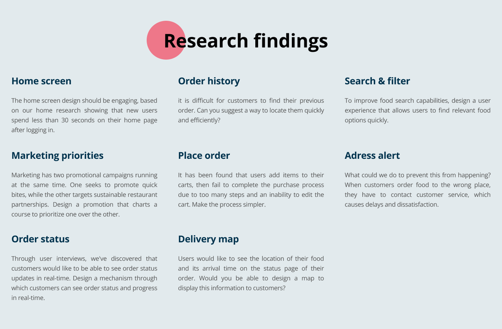
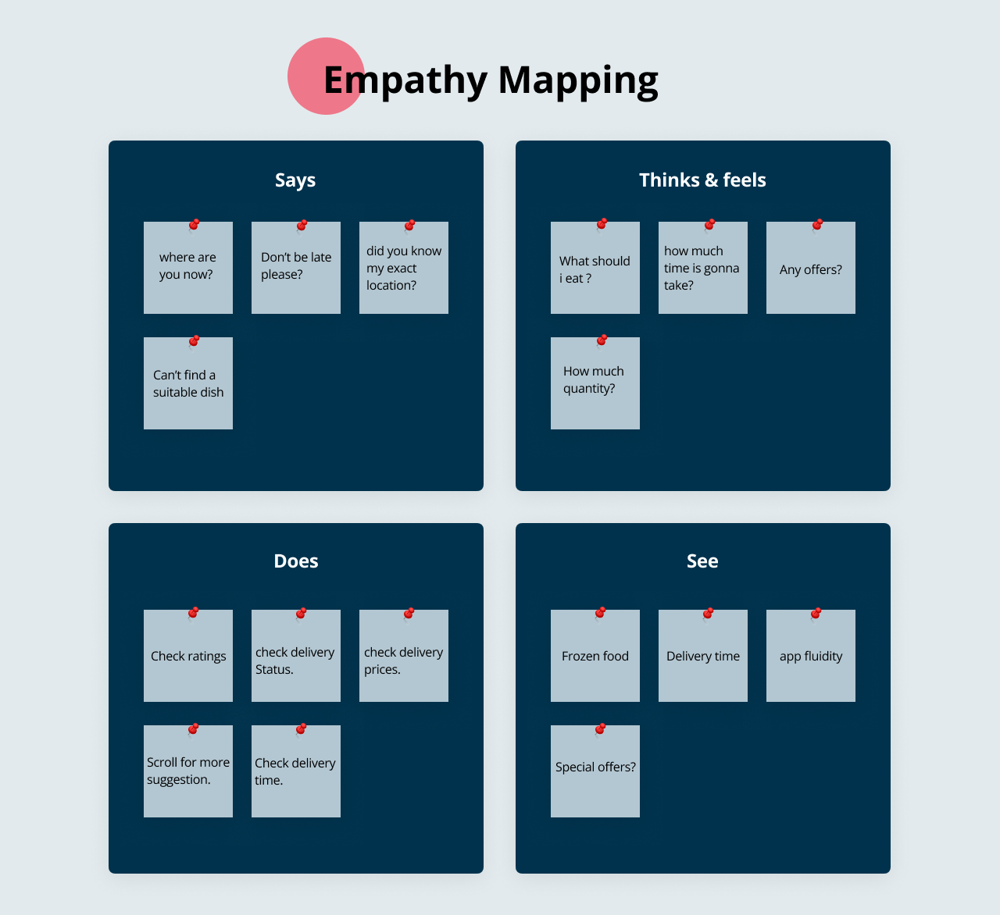
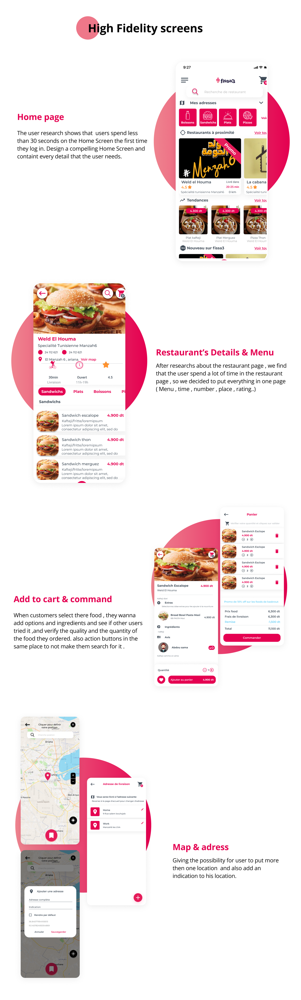

# Fissa3

Description: During my time at Tledger 2020
Tags: UI Design, UX Design

### Fissa3 advantage :

Fissa3 sets up an offer adapted to your needs and more than 100 delivery people At your disposal. Fissa3 offers you visibility and free advertising through its Social networks and its platform. Fissa3 helps you increase your Sales.

## How it works :

An easy-to-use restaurant application that allows you to: To receive your orders To ensure the traceability of the order Consult the history Each order is paid as soon as you leave the restaurant to ensure you The follow-up of your caisse. If you make a delivery from the platform, Fissa3 will take only 5% of fees. The service will be Free for the first 45 days.

### User research :

User research is undertaken in order to elicit information from a wide range of perspectives on how to develop a new strategy.

### User experience design :

Designing mobile apps : Users experiences play a crucial part in the visual parts of an app.

### Visual design :

Visual design: Create an intuitive user-centric design interface that is convenient and appealing to users.

---

## ✏️ Solving the problem

**Restaurant profile :**

It will be easy for customers to find or order the quality of a restaurant if they can see its profile and review it.

**Prognotic search :**

filter and predictive search options help users find what they are looking for quickly and easily.

**Live updates :**

This feature allows the user to track the food delivery boy so they can receive the order at their doorstep.

**Push notifications :**

Notify your users of new offers or food order histories through this feature. This will increase your app's usability.

**Geo location :**

Customers can track there meal's location in real time through GPS.

**Order customization :**

Customization of orders can be made by the customer based on their needs.

---

---

---

---

---

# 🚀Asset

---

💫 Figma Prototype file

[https://www.figma.com/proto/PWUGped83tfzzkMDHi2Dvy/Fissa3.1?page-id=1%3A13869&type=design&node-id=4-24595&viewport=-98%2C169%2C0.04&t=tQDSPLSHLlKRYpt6-1&scaling=min-zoom&starting-point-node-id=601%3A756&mode=design](https://www.figma.com/proto/PWUGped83tfzzkMDHi2Dvy/Fissa3.1?page-id=1%3A13869&type=design&node-id=4-24595&viewport=-98%2C169%2C0.04&t=tQDSPLSHLlKRYpt6-1&scaling=min-zoom&starting-point-node-id=601%3A756&mode=design)