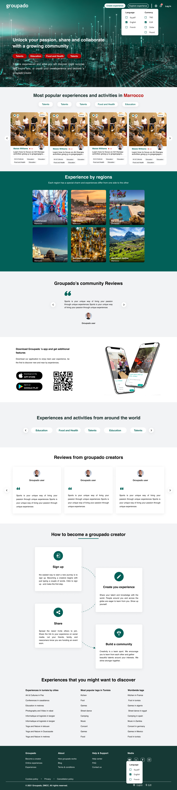
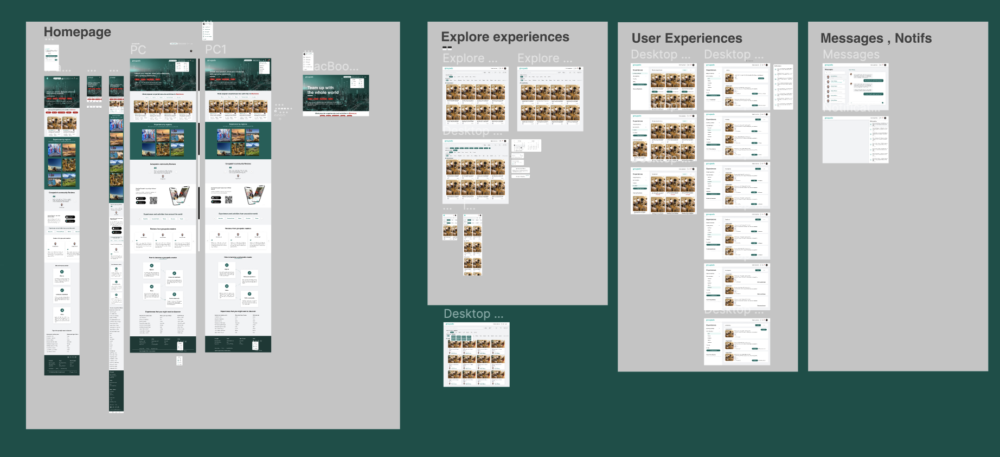
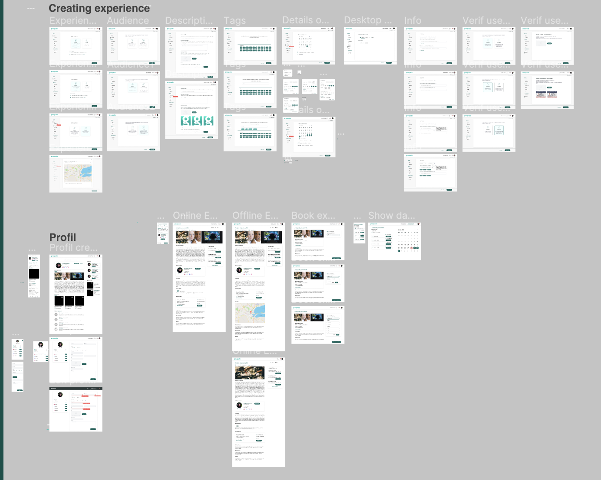

# Groupado

Description: My experience in 2021 
Tags: UI Design, UX Design, website

## 👋🏼 Intro

I had the opportunity to join the startup Groupado after opening there first office in Tunisia , and there second coming from Dubai , was an experience of 8months and we managed to create some websites and a mobile application . one of them is there main product “ Groupado “ that is a  website and a mobile application that allows users to become creators and create experiences online and local and also users can participate in those experiences , basically to learn and teach and to do activities . 

### The Problem

---

How to create a platform for people with talent, knowledge, or skills to teach others, and for users to find the right activities to do or subjects/skills to learn, both online and outdoor?

### Solution

---

Groupado could create a platform that allows users to create and publish their own classes, workshops, and other learning experiences. The platform could also provide users with the tools they need to promote and sell their offerings.

The main focus of the homepage was the SEO of the website so We added most of the slider about the places and location mostly the keywords that are related to the product and most trusted and rated in the search engine optimisation .

### **Features**

---

- One challenge of creating a platform for people to teach others is ensuring that the quality of the teaching is high. Groupado could address this challenge by requiring teachers to meet certain criteria before they are allowed to publish their courses. For example, Groupado could require teachers to have a certain level of experience or expertise in the subject matter that they are teaching.
- Another challenge is ensuring that users can easily discover the classes and workshops that they are interested in. Groupado could address this challenge by developing a robust course discovery system. This system could include a search function, a browse by category function, and a personalized recommendation engine.
- Finally, Groupado will need to ensure that its platform is secure and that users' personal and financial information is protected. Groupado could address this challenge by implementing appropriate security measures, such as data encryption and fraud prevention systems.

Overall, creating a platform for people to teach others and for users to find learning experiences is a complex challenge, but it is also a rewarding one. Groupado has the potential to make a significant impact on the way that people learn and teach.

### 🚀 The Outcome

---

