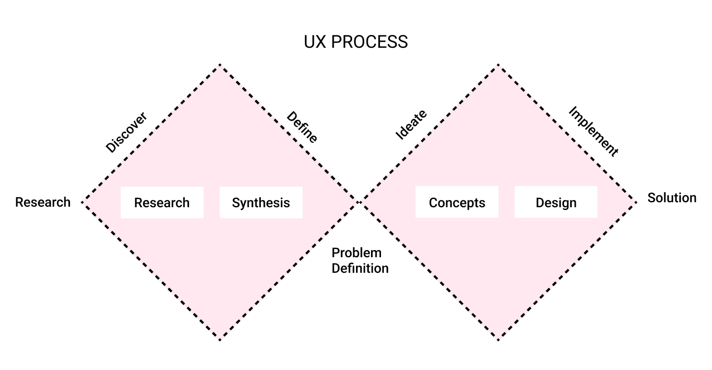
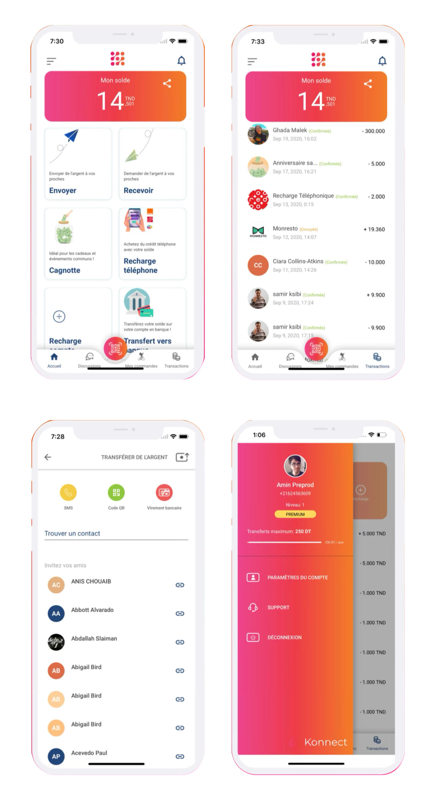

# Konnect

Description: Mobile application for online payment
Tags: UI Design, UX Design

# 👋🏼 Intro

---

During my 1-year tenure as a UI/UX designer at T-ledger, a fintech startup, I had the opportunity to work on a project called "Konnect". Throughout this period, we undertook the entire design process, identified current problems, and completely redesigned the application. We also engaged in back-and-forth brainstorming sessions with the CTO to reach the final functional product.

### Role

---

### Tools

---

UX Design

UI Design

Prototyping

Product Strategy

Figma

Jira

## The Problem

---

Back in 2020, Tunisia faced a significant problem with online payments. [Konnect](https://konnect.network/) emerged as the solution to this issue. Users can now have a digital wallet that enables them to make online payments in Tunisia. Additionally, [Konnect](https://konnect.network/) offers features such as sending and receiving money through bank transfers, buying phone credits, and connecting to the user's bank account via bank transfer. All of these features are highly secure, thanks to the use of blockchain technology.

### Presentation

---

[Konnect](https://konnect.network/) Networks is a pioneer in the payment industry in Tunisia. Konnect Networks helps businesses of all sizes to grow and develop by using different payment methods. With the help of a simple and clear payment solution, [Konnect](https://konnect.network/) Networks can offer multiple payment methods in a simple and intuitive way. [Konnect](https://konnect.network/) Networks' mission is to become the most appreciated PSP in Tunisia by simplifying complex financial flows. [Konnect](https://konnect.network/) Networks currently has nearly 2,000 users in Tunisia.

### **The Outcome**

---

## ✅ Validating the design

Design validation is crucial to ensure the final product meets criteria and expectations. Steps:

1- Define objectives clearly.

2- Involve stakeholders from start.

3- Hold regular design reviews for feedback.

4- Use visual aids like prototypes.

5- Gather remote feedback through tools.

6- Encourage constructive criticism.

7- Conduct user usability testing.

8- Document decisions and changes.

9- Address conflicts professionally.

10- Iterate and refine based on feedback.

## 🎯 Verdict

I had a lot of fun working on konnect! the cto was a big help and someone you up to , he was full of idea and we were able to get a lot done in every collaboration . 

I am exteremely happy that the team still uses my design, till this day , we could see many positive effects on the product develepement and the consistency of it .

Konnect Landing page : [https://konnect.network/](https://konnect.network/)

- Konnect Mobile application :
    
    IOS : [https://apps.apple.com/us/app/konnect-pay/id1560555304](https://apps.apple.com/us/app/konnect-pay/id1560555304)
    
    Android :[https://play.google.com/store/apps/details?id=network.konnect.konnect](https://play.google.com/store/apps/details?id=network.konnect.konnect)