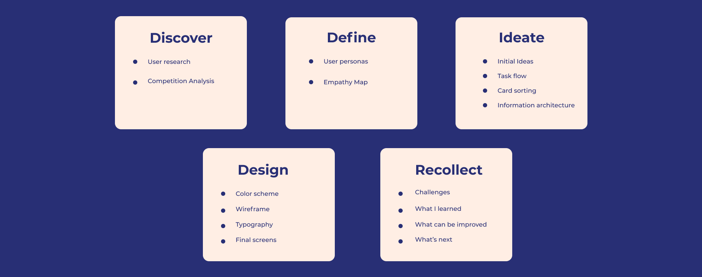
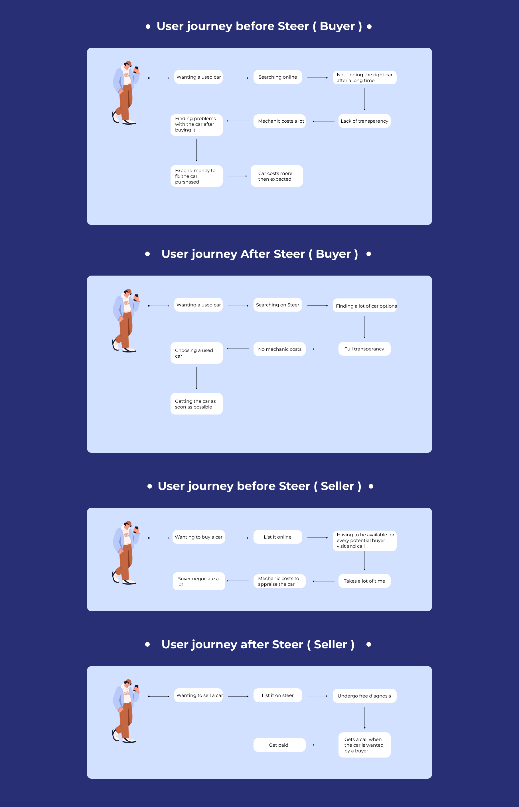
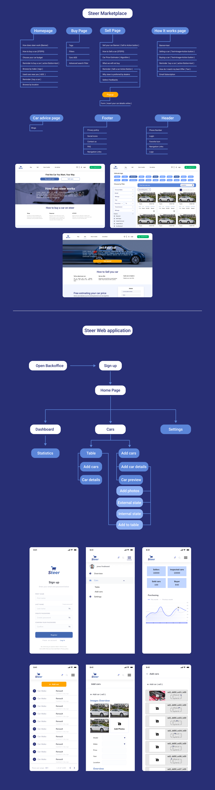

# Steer

Description: Steer provides end-to-end solutions to reinvent the automotive retail industry
Tags: Product Design, UI Design, UX Design

# 👋🏼 Intro

During the web application process for a Chief Product Officer role at **Steer**, I had the great opportunity to work on a web application for a corporate website, including the pitch and the overall visual identity of Steer. We began by creating an identity for the startup, focusing on market research and developing the entire product (problem statement and solution). Once we had a good understanding of the market, we brainstormed ideas and I created low-fidelity designs. We validated these designs and then moved on to high-fidelity designs. Once the high-fidelity designs were complete, we discussed them with the developer and I followed every step of the development process. We decided to build a website for B2B businesses to present our work. Using the design tools **Miro** and **Figma**, I followed a multi-step design process to uncover problems, generate ideas, and communicate them in both low and high-fidelity designs.

# Role

🎨 Chief Product Officer

# About the project

The used car market poses challenges and opportunities for both new and established players. New cars are becoming increasingly expensive in emerging countries, while used cars may not always be reliable. To address this, we are building a C2C marketplace where buyers can access detailed and verified information about used cars, along with a pricing algorithm and additional services such as warranties and financing solutions offered by our partners.

Additionally, we offer a B2B solution for used car professionals. This web application platform provides various digital services including car inspections, analysis of the car's health status, stock management, and digital marketing.

# The Problem

We identified that buying and selling used cars requires a lot of process, lots of time as well, and you can't always trust the mechanics. There are a lot of red flags, and it takes a lot of energy and time to find the right used car. There is so much lack of transparency. Used car inspections cost a lot each time you go to see a car. Also, you need to ask a lot to find the speculation of each car's price.

# Solutions

A highly scalable and innovative digital inspection technology, combined with a cutting-edge pricing algorithm, is the foundation of our platform. This technology allows for efficient and accurate inspections, ensuring the highest level of quality and reliability. Additionally, our marketplace offers advanced customer services to provide a seamless experience for both buyers and sellers. With our platform, you can expect unparalleled convenience, reliability, and support.

# 📔 Design process

# 👤 User research

Used cars are a significant part of the current market. However, there are several issues that exist within the marketplace, such as unreliable mechanics, inaccurate pricing, and incomplete details about listed cars. Sellers may provide false information to potential buyers, which can lead to dissatisfaction and a lack of trust in the used car market, especially for first-time buyers. To address these concerns, I conducted research and created a survey for individuals who have purchased or are considering purchasing a used car, as well as those seeking transparent diagnosis for their vehicles. I designed this survey to gather information from 20 participants in order to define our user persona.

I have formulated specific questions to help resolve these problems and ensure a smooth user experience for our digital product and its users.

### Questions :

How old are you ?

Do you work ? ( Yes / No )

What’s your budget ?

What are you looking for in the car you want to buy  (Car options) ?

From where you bought your used car ?

How much time did it take you to buy the car ?

Were there any difficulties or deceptions when looking or visiting a car ?

The profile of the sellers ?

Mechanic’s cost ?

### Answers :

We gathered with 15 people to conduct a meeting and gather their responses based on their life experiences. Here are the results:

### Insights :

These questions helped me gain a clear understanding of my users, their main frustrations, and goals. They provided valuable insights into the challenges people encounter when buying a used car.

Based on this information, I will use these questions as a foundation for the next steps in the design process of Steer.

# 📒 Competitor analysis

# 👥 User personas

# 👉🏼 User journey

# 🚀 Assets

## 🌐 Coorporate page web design

<aside>
👋🏼 https://www.figma.com/file/U2lrWQfNfT0k23bikH39gS/Coorporate-Page?type=design&node-id=0%3A1&mode=design&t=4nGo8bVeswDiKTty-1

</aside>

## 📱Web application Steer

<aside>
👋🏼 https://www.figma.com/file/sd6CIVD7b5OA8gLJEG6cZi/V1-dashboard?type=design&node-id=102%3A11&mode=design&t=AXFqDuYw7osDsOZY-1

</aside>

# 🖱️User Flow

