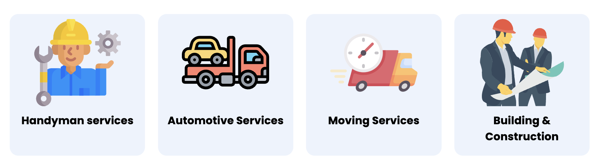

# Fixerloop

Tags: Mobile, UI design, UX design

## 👋🏼 Intro

Fixerloop facilitates connections between homeowners and service providers through an efficient, transparent, and user-friendly platform. I had a meeting with the founder where we discussed the application's shortcomings. After conducting research, he emphasized the significance of prioritizing a user-friendly design .

## The problem

the app was too complicated for the user to understand it , colors are not compatable with each other , text is not understood in some areas and not very simple to use , the founder was not convinced that the application is easy for the user .

## Solution

We did some testing and we trying to understand the problem , we tried to make it clear for the user , We connect professional service providers with clients in need of professional services is several fields. 

---

### Landing Page :

[Fixerloop](https://www.fixerloop.com/#services)

### Figma design system and App design

[https://www.figma.com/file/yhJAcOO7JbbtQYpv7Kzg2k/Fixerloop?type=design&node-id=0%3A1&mode=design&t=Kmx3VSEGI7lWi95t-1](https://www.figma.com/file/yhJAcOO7JbbtQYpv7Kzg2k/Fixerloop?type=design&node-id=0%3A1&mode=design&t=Kmx3VSEGI7lWi95t-1)