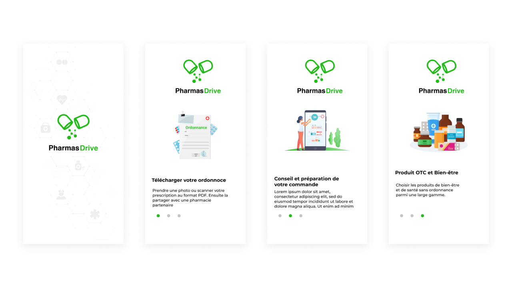
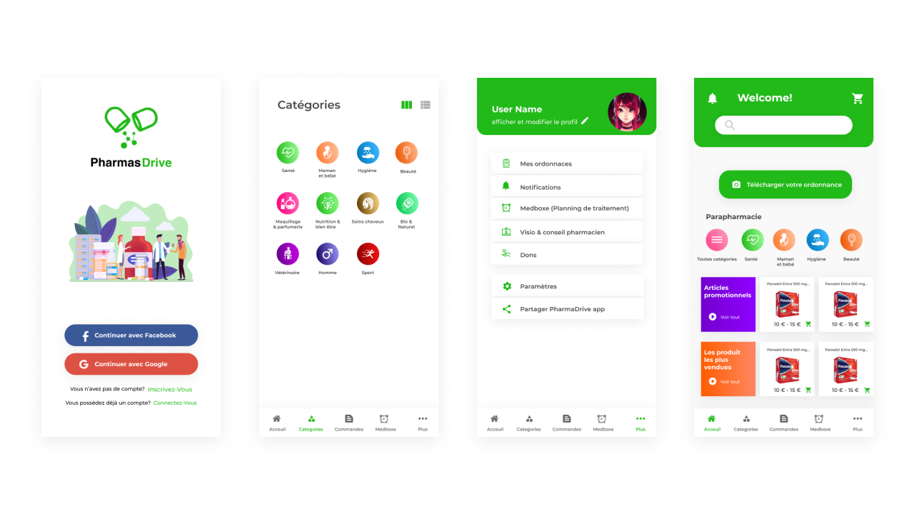

# PharmaDrive

## 👋🏼 Intro

---

In 2021, I worked as a freelancer with T+ informatique, a startup based in France. Together, we designed a mobile application for pharmacies and pharmaceutical products.

Welcome to the future of pharmacy management and pharmaceutical product access with our cutting-edge mobile application! In a world where convenience and efficiency are paramount, our app is your gateway to a seamless and hassle-free experience when it comes to all your pharmacy and pharmaceutical product needs. Say goodbye to long queues, paperwork, and the frustration of searching for the right medication. With our app, you'll discover a world of possibilities at your fingertips, offering you a faster, smarter, and safer way to manage your health and wellness. Whether you're a pharmacy owner looking to streamline operations or a customer seeking easy access to medications, we've got you covered. Join us on a journey where technology and healthcare meet, simplifying your life while ensuring your well-being.

## Solution

---

Introducing our groundbreaking mobile application, [Your App Name], designed to revolutionize the healthcare and pharmaceutical industry. In a world rife with challenges like long queues, cumbersome paperwork, and the need for swift medication access, our app offers an innovative solution. It simplifies prescription management, allows users to effortlessly search for and order pharmaceutical products, and provides pharmacies with tools to streamline their operations. With real-time notifications, secure payment options, and a seamless user experience, we make healthcare management convenient and efficient. Our app is a win-win for both customers and pharmacies. It's not just an application; it's a healthcare revolution in the palm of your hand. Join us on this transformative journey and be part of a brighter, healthier future.

## The outcome

---

