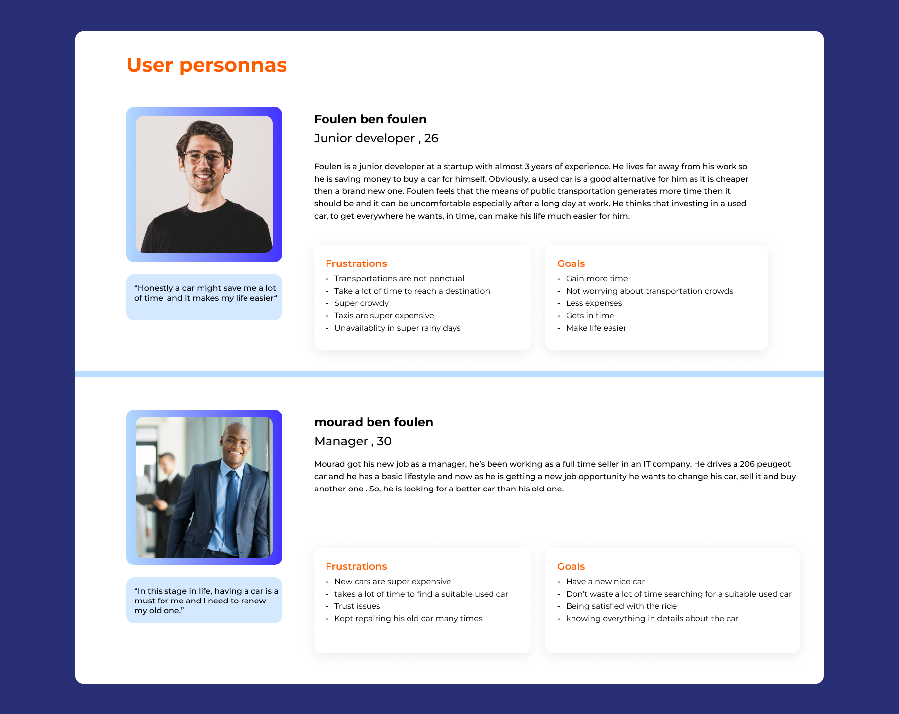
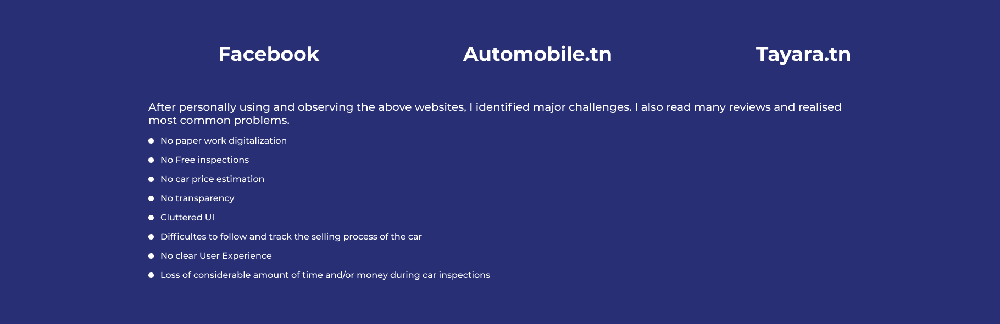
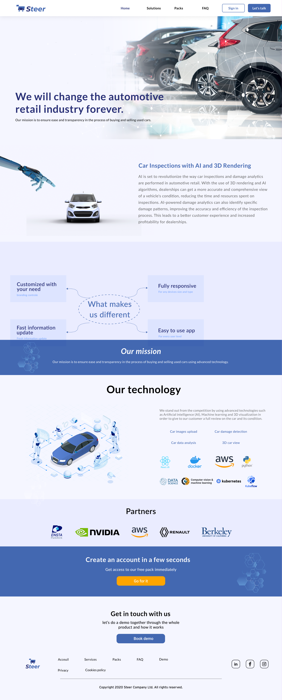
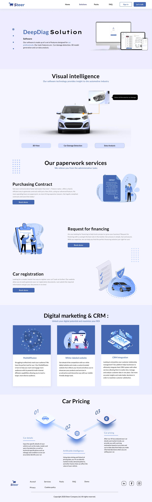
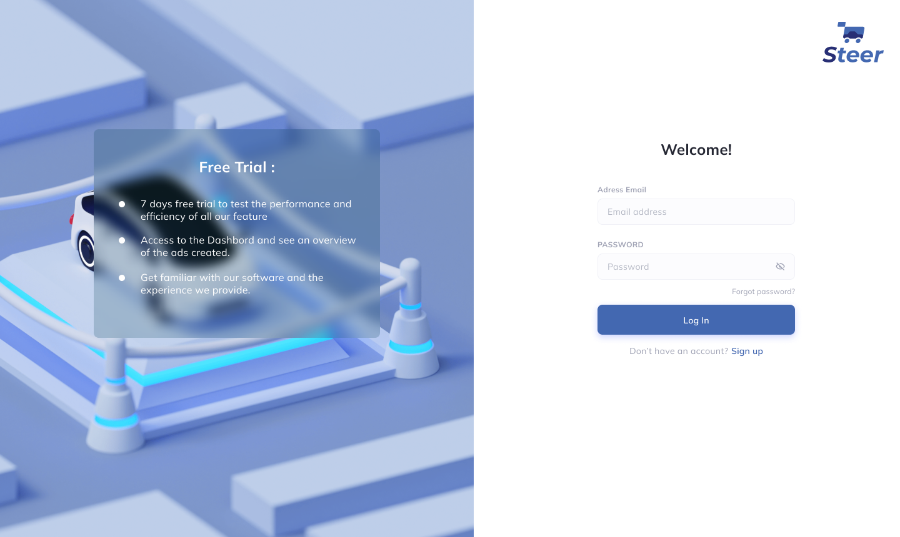
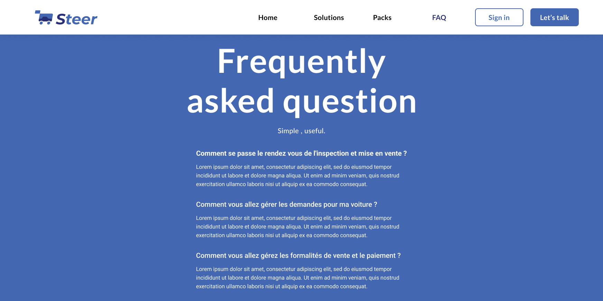

# Steer

**End-to-end solutions to reinvent the automotive retail industry**

A C2C marketplace for used cars built on verified inspection data and a pricing algorithm, plus a B2B web platform for used-car professionals. I set the product direction, ran the research, and designed the identity, the corporate site and the dashboard.

| | |
|---|---|
| **Role** | Chief Product Officer — in practice product design and product management |
| **Client** | Steer |
| **Year** | 2022–present |
| **Duration** | Ongoing |
| **Team** | Small product team; I led design and worked directly with the developer through build |
| **Status** | In development |
| **Platforms** | Web app, Corporate website |
| **Tools** | Figma, Miro |

## At a glance

- **20 participants** — Survey designed for
- **15 people** — Interviewed in person

## Links

- [Corporate page (Figma)](https://www.figma.com/file/U2lrWQfNfT0k23bikH39gS/Coorporate-Page)
- [V1 dashboard (Figma)](https://www.figma.com/file/sd6CIVD7b5OA8gLJEG6cZi/V1-dashboard)

## About the project

The used-car market is difficult on both sides. New cars are getting more expensive in emerging markets, which pushes buyers toward used ones — but a used car may not be reliable and there is no easy way to know before you buy. Steer set out to fix that with two products: a C2C marketplace where buyers get detailed, verified information about a car alongside a pricing algorithm and partner services like warranties and financing, and a B2B web platform for used-car professionals covering inspections, vehicle health analysis, stock management and digital marketing.

## The problem

Buying or selling a used car takes an enormous amount of process and time, and you cannot always trust the mechanic. There are red flags everywhere and very little transparency. Every car you go to see costs another inspection fee. Working out whether a given price is fair means asking a lot of people a lot of questions. First-time buyers are the most exposed, because sellers can give false information and there is no straightforward way to check it.

## Design process

We started by building an identity for the startup and grounding it in market research, working the problem statement and the solution together before touching any interface. Once we understood the market we brainstormed, and I produced low-fidelity designs. We validated those, moved to high fidelity, then walked the developer through them and I followed every step of the build. Miro carried the thinking, Figma carried the design.

*The multi-step process used to uncover problems, generate ideas and communicate them in low and high fidelity.*

## User research

I wrote a survey for people who had bought a used car, were considering one, or wanted a transparent diagnosis of a car they already owned. It was designed for 20 participants and I sat down with 15 of them to gather their answers from lived experience. The questions covered age, employment, budget, what they look for in a car, where they bought it, how long it took, what deceptions they ran into when viewing cars, the profile of the sellers, and what the mechanic cost them. The answers gave me a clear read on their frustrations and goals, and became the foundation for everything that followed.

*Survey results.*

*Personas derived from the research.*

*User journey.*

## Competitor analysis

Mapping the existing players showed where the market left buyers unprotected, and where verified inspection data could become the thing that differentiated Steer rather than just another listing site.

*Competitor analysis.*

## The solution

The platform rests on scalable digital inspection technology paired with a pricing algorithm, so an inspection is efficient, repeatable and trustworthy rather than a cost you pay again at every viewing. On top of that sits a marketplace with customer services designed to make both buying and selling feel supported instead of adversarial.

*User flow.*

## The corporate site

We built the B2B-facing website to present the work: what Steer does, who it is for, and how a professional gets started.

*Homepage.*

*Solution page.*

*Login and free trial.*

*FAQ.*

---

## TODO — needs Abdallah

_Not published copy. These are gaps I could not fill from the Figma file or the Notion export._

- [ ] Confirm the start date — the Notion bio says you joined Steer as CPO 'two years ago', which I've read as 2022. Fix if wrong.
- [ ] Is Steer live? A launch date, user count or partner count belongs in metrics.
- [ ] The B2B dashboard (V1 dashboard Figma file) isn't in this portfolio file. Send the link and I'll pull screens — the dashboard is the more impressive artefact.
- [ ] Name the team size you led, if you're comfortable doing so.
