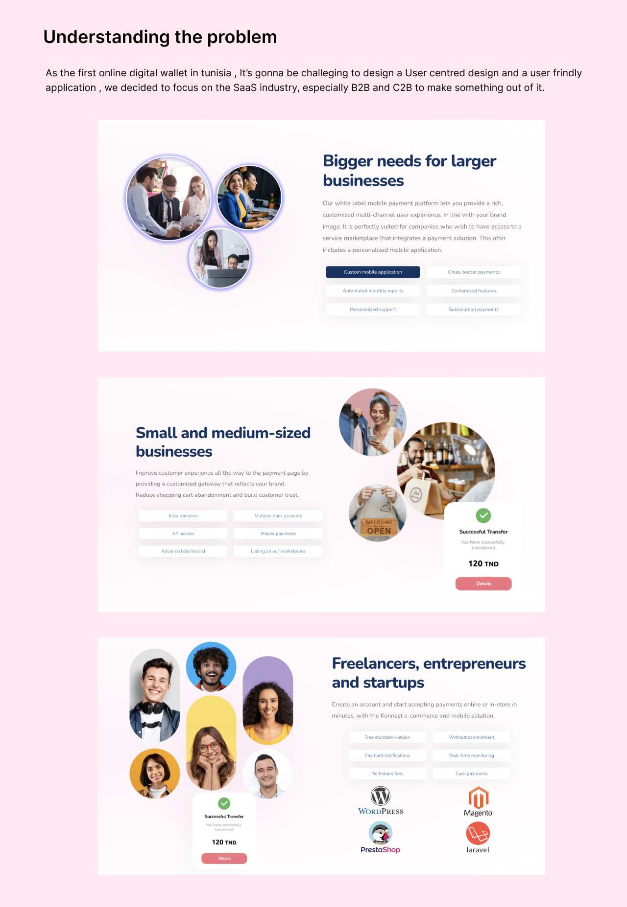
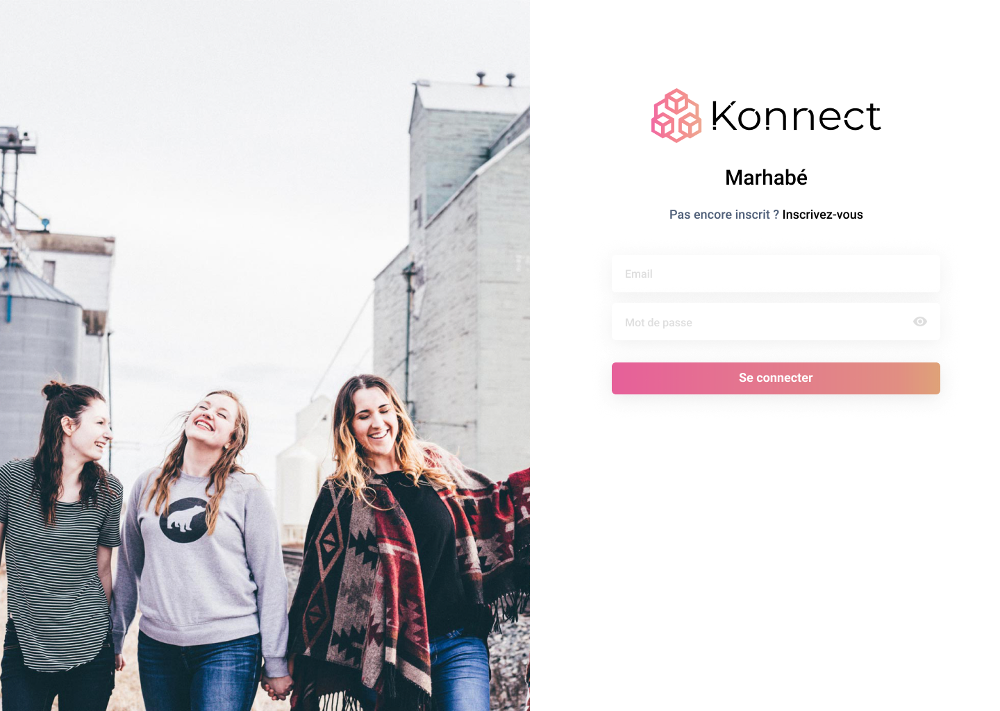

# Konnect

**The first digital wallet in Tunisia**

Konnect set out to solve online payment in a country where it barely worked. I joined T-ledger as the only designer among more than fifteen engineers and two product managers, ran the full design process, and rebuilt the application end to end. The team still uses that design today.

| | |
|---|---|
| **Role** | Product Designer — sole designer |
| **Client** | T-ledger |
| **Year** | 2020–2021 |
| **Duration** | February 2020 – January 2021 |
| **Team** | One designer (me), 15+ engineers, 2 product managers |
| **Status** | Shipped — live on iOS and Android |
| **Platforms** | iOS, Android, Web |
| **Tools** | Figma, Jira |

## At a glance

- **~2,000** — Users in Tunisia
- **1 — me** — Design team
- **15+** — Engineers supported

## Links

- [konnect.network](https://konnect.network/)
- [iOS App Store](https://apps.apple.com/us/app/konnect-pay/id1560555304)
- [Google Play](https://play.google.com/store/apps/details?id=network.konnect.konnect)

## Overview

Konnect began designing its mobile application with the ambition of becoming the biggest digital wallet platform in Tunisia. The goal of this particular piece of work was to identify what was actually broken about online payment in the country, and — with the beta already out — determine the critical features and set the priorities for the next iteration of the product.

## The problem

Back in 2020 Tunisia had a serious problem with online payments: for most people, they simply did not work. Konnect answered that with a digital wallet that lets users pay online, send and receive money by bank transfer, buy phone credit, and connect straight to their bank account — all secured with blockchain. Designing the first online digital wallet in a market meant there was no local convention to lean on, so we focused on the SaaS side, particularly B2B and C2B, and built the user-centred design from there.

*Understanding the problem.*

## I was the whole design team

I joined Konnect as a product designer in early 2020 as the only designer in a company of more than fifteen engineers and two product managers. I supported design across every part of the business and led UX and UI on the key parts of the application side of the platform. Over that year I implemented a design process where there had been none, learned to work with the development team and built a real communication channel with them, established a design system, and designed the final brand and identity of Konnect.

## UX process

The work ran on a discover, define, ideate, implement loop — research and synthesis feeding a sharp problem definition, then concepts and design feeding a solution. Working with the CTO meant constant back and forth, which is the reason the final product ended up functional rather than merely drawn.

*Discover, define, ideate, implement.*

## Validating the design

Validation was how we kept the product honest. Define the objectives clearly, involve stakeholders from the start, hold regular design reviews, use prototypes rather than descriptions, gather remote feedback with proper tooling, actively encourage criticism, run usability testing with real users, document every decision and change, handle disagreement professionally, and iterate. Each of those exists because skipping it cost us something at least once.

*Validating the design.*

## The outcome

Konnect Networks is now a pioneer in the Tunisian payment industry, helping businesses of every size grow by offering multiple payment methods through one simple interface, with the stated mission of becoming the most trusted PSP in the country by simplifying complex financial flows. The CTO was a genuine collaborator — full of ideas, and we got a great deal done in every session. The part I am most pleased about is that the team still uses my design today, and you can see the effect in how consistent the product has stayed as it has grown.

*Konnect platform.*

---

## TODO — needs Abdallah

_Not published copy. These are gaps I could not fill from the Figma file or the Notion export._

- [ ] Four more Konnect desktop screens are in the Figma file but weren't exported before the Figma rate limit hit. They'll be added on the next pass.
- [ ] The ~2,000 user figure comes from your Notion and is from 2023 — worth updating if you know the current number.
