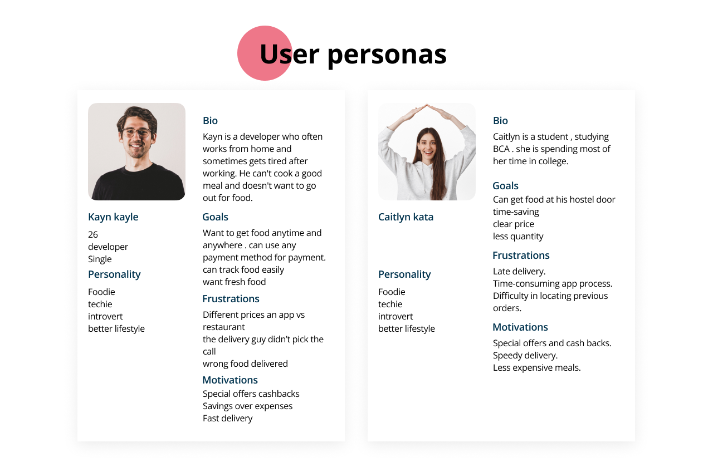
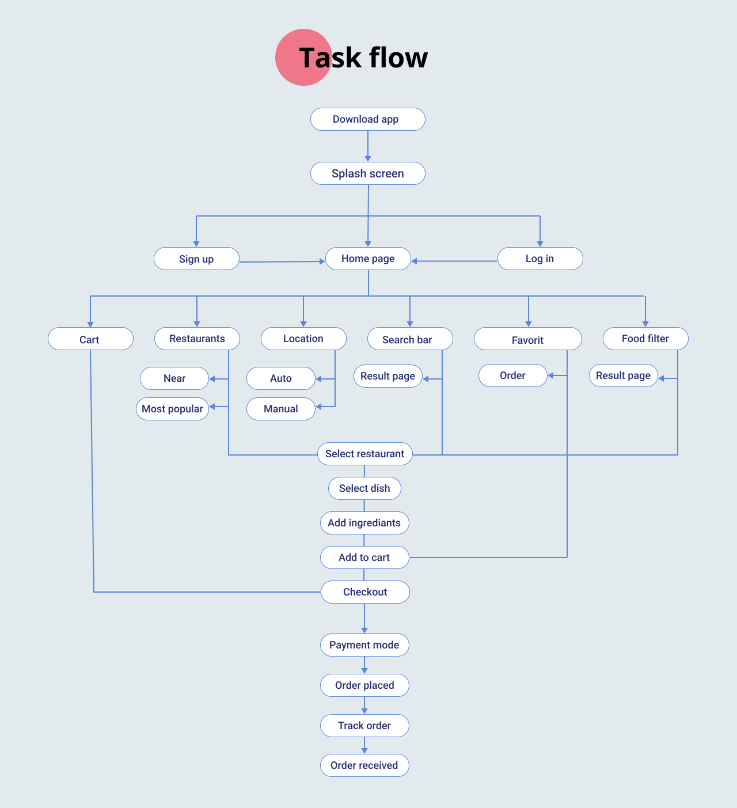
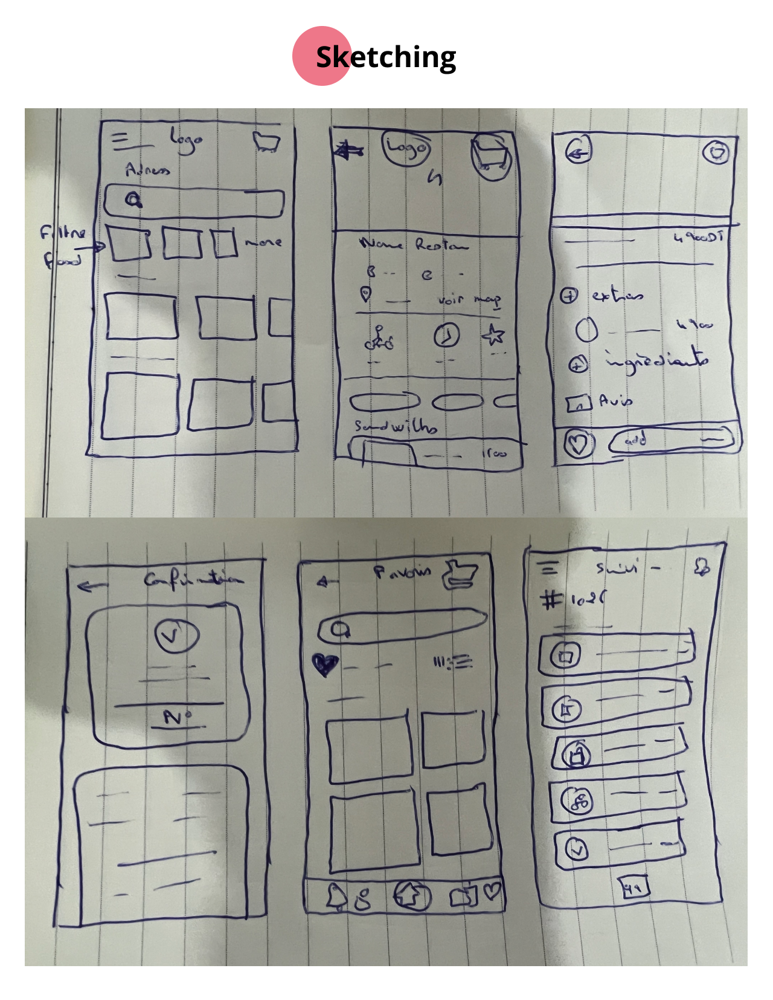
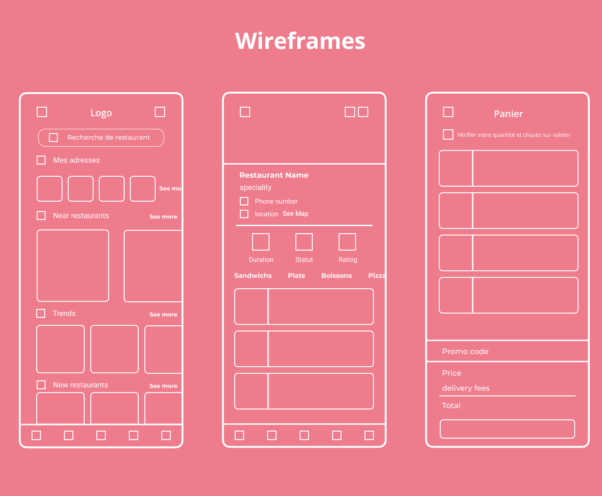

# Fissa3

**Food delivery built as a social and solidarity economy**

A Tunisian food delivery platform whose stated purpose was not margin but employment — developing the business of restaurateurs and creating work for people who did not have it. I ran the research, personas and empathy mapping, then took it from task flows through sketches and wireframes to high fidelity.

| | |
|---|---|
| **Role** | UX / UI Designer |
| **Client** | T-ledger |
| **Year** | 2020 |
| **Duration** | January – March 2020 |
| **Team** | TODO |
| **Status** | TODO — confirm whether Fissa3 launched |
| **Platforms** | Mobile app |
| **Tools** | Figma |

## At a glance

- **100+** — Delivery people available
- **5%** — Platform fee
- **45 days** — Free trial for restaurants

## Links

- [Interactive prototype (Figma)](https://www.figma.com/proto/PWUGped83tfzzkMDHi2Dvy/Fissa3.1)

## What Fissa3 was for

Fissa3 was a new Tunisian food delivery platform, and part of what made it worth designing was that it belonged to the social and solidarity economy. Its objective was to promote the development of restaurateurs' business and to create work opportunities for the unemployed, in order to stimulate employment. For a restaurant, it meant an offer adapted to their needs, more than a hundred delivery people at their disposal, and visibility and free advertising through the platform and its social channels.

## How it works

The restaurant-side app was built to be genuinely easy: receive your orders, keep traceability on each one, and consult the history. Every order is settled as it leaves the restaurant, so the till reconciles itself. If the delivery goes through the platform, Fissa3 takes only 5%, and the service is free for the first 45 days.

## User research

Research came first, deliberately drawing on a wide range of perspectives rather than a single assumed customer. That produced two people we designed against. Kayn is a developer who often works from home and is tired after work; he cannot cook a decent meal and does not want to go out for one. He wants food at any time in any place, any payment method he likes, easy tracking, and food that is actually fresh — and what puts him off is app prices differing from restaurant prices, delivery riders not answering the phone, and the wrong food arriving. Caitlyn is a student studying BCA who spends most of her time on campus. She wants food at her hostel door, saved time and a clear price — and her frustrations are late delivery, a time-consuming app process, and not being able to find her previous orders.

*Research findings.*

*Personas.*

*Empathy mapping.*

## The problems worth solving

Research turned into a set of specific, checkable problems rather than a vague brief. New users spend less than thirty seconds on the home screen after logging in, so the home screen had to earn attention immediately and hold everything they needed. Users spent a long time on restaurant pages, so we put everything — menu, hours, phone, location, rating — on one page instead of scattering it. Customers abandoned full carts because checkout had too many steps and they could not edit the cart. Finding a previous order was hard. Ordering to the wrong address meant calling customer service, which meant delay and a bad first impression. And marketing had two campaigns running at once — promoting quick bites and promoting sustainable restaurant partnerships — which needed a promotion surface that could prioritise one over the other rather than showing both and diluting each.

*Task flow.*

## Solving them

Restaurant profiles let customers judge quality and leave reviews before ordering. Predictive search with filters made finding a specific dish fast instead of exploratory. Live updates and GPS geolocation let customers watch the order move and know when it would arrive, which removed the phone call. Push notifications carried new offers and order history, which gave people a reason to return. Order customisation let people add options and ingredients and see what others thought of a dish, with the action buttons kept in the same place so nobody had to hunt for them. And addresses became plural — several saved locations, each with a written landmark, because a Tunis address alone is often not enough to find a door.

*Sketching.*

*Wireframes.*

*High fidelity.*

---

## TODO — needs Abdallah

_Not published copy. These are gaps I could not fill from the Figma file or the Notion export._

- [ ] Did Fissa3 launch? If it did, when, and roughly how many restaurants or orders?
- [ ] Who else was on the project — were you the only designer as at Konnect?
- [ ] The tall Fissa3 case-study board in the Figma file duplicates this content and can be exported in sections if you want the original layout as images.
- [ ] Both personas are described with 'he' in the source for Kayn and 'she' for Caitlyn — I've kept that. Note Caitlyn's persona text also appears with mixed pronouns in the original; worth a proofread.
