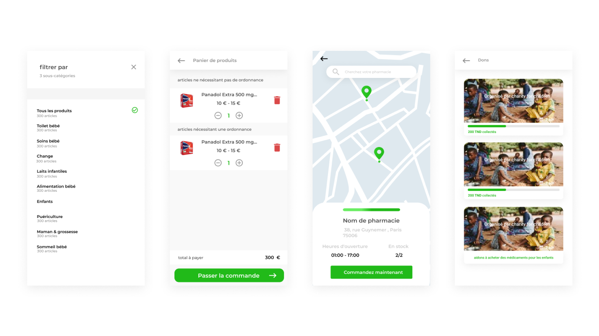

# PharmaDrive

**Pharmacy management and medication access, on web and Android**

A French pharmacy platform covering both sides of the counter: customers ordering medication and managing prescriptions, and pharmacies running their operations. Designed as a freelancer with T+ informatique across a web platform and an Android app.

| | |
|---|---|
| **Role** | UX / UI Designer (freelance) |
| **Client** | T+ informatique — France |
| **Year** | 2021 |
| **Duration** | TODO |
| **Team** | TODO |
| **Status** | TODO — confirm whether PharmaDrive shipped |
| **Platforms** | Web, Android |
| **Tools** | Figma |

## Intro

In 2021 I worked as a freelancer with T+ informatique, a startup based in France, designing a platform for pharmacies and pharmaceutical products. It spans a web application and an Android app, in French, and it addresses two different users who happen to stand on opposite sides of the same counter.

## The problem

Getting medication is slower and more frustrating than it needs to be. Queues, paperwork, and the particular anxiety of not knowing whether the pharmacy you are walking to actually stocks what you were prescribed. On the other side, pharmacy owners are running operations on processes that do not talk to each other.

## The solution

The platform simplifies prescription management, lets people search for and order pharmaceutical products directly, and gives pharmacies tools to streamline how they operate. Real-time notifications keep an order visible as it moves, and secure payment closes the loop. The design brief was convenience on the customer side and operational clarity on the pharmacy side, without either one compromising the other.

## The outcome

Onboarding, prescription management ('Mes ordonnances'), product search and ordering, and a donations flow ('Dons') across web and Android.

*Onboarding.*

*Application screens.*

*Application screens.*

---

## TODO — needs Abdallah

_Not published copy. These are gaps I could not fill from the Figma file or the Notion export._

- [ ] This is the largest project in the Figma file — roughly 10 desktop screens and 14 Android screens — and none of them were exported before the Figma rate limit hit. They're the priority on the next pass.
- [ ] What is the 'Dons' (donations) screen for? Donating unused medication, or something else? It's unusual and probably the most interesting thing here.
- [ ] How long did the engagement run?
- [ ] Did it ship? A pharmacy count or a launch date would help.
- [ ] The Notion write-up still contains the placeholder '[Your App Name]' — I've written around it, but confirm the product's real public name.
