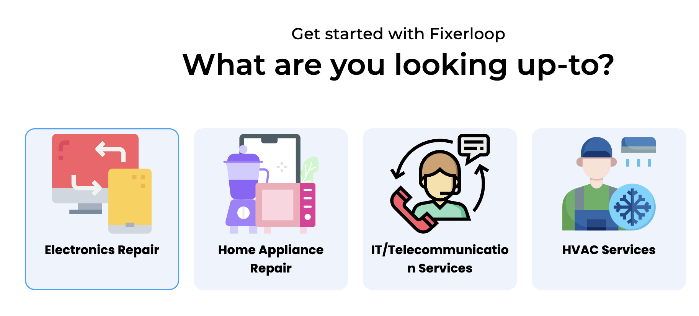
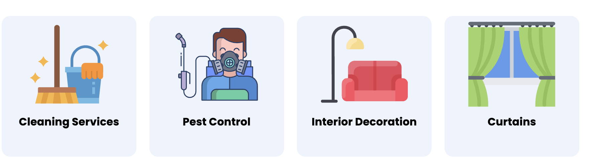

# Fixerloop

**Rescuing a services marketplace its own founder found confusing**

Fixerloop connects homeowners with professional service providers. The founder came to me because the app was too complicated to use — clashing colours, unclear copy, and a flow he could not defend. I rebuilt it around a proper component library and a design system.

| | |
|---|---|
| **Role** | UX / UI Designer |
| **Client** | Fixerloop |
| **Year** | 2023 |
| **Duration** | TODO |
| **Team** | Worked directly with the founder |
| **Status** | Shipped — fixerloop.com is live |
| **Platforms** | Mobile app |
| **Tools** | Figma |

## Links

- [fixerloop.com](https://www.fixerloop.com/#services)
- [Design system and app design (Figma)](https://www.figma.com/file/yhJAcOO7JbbtQYpv7Kzg2k/Fixerloop)

## Intro

Fixerloop connects homeowners with service providers through a platform meant to be efficient, transparent and easy to use. I met the founder and we went through where the application was falling short. After research, the thing he kept returning to was that the design had to become genuinely user-friendly before anything else was worth doing.

## The problem

The app was too complicated for users to understand. The colours did not work together. The text was unclear in places, and the whole thing was not simple to use. The founder was not convinced his own application was easy for a customer — which is about as direct a brief as you can get.

## The solution

We tested, worked to understand where people were actually getting stuck, and rebuilt for clarity. The platform connects professional service providers with clients who need work done across several fields, so the design had to hold two distinct users — the customer looking for someone, and the provider managing requests and orders — without either flow feeling like an afterthought bolted onto the other.

## A component library underneath

The rebuild sits on a real design system rather than a set of drawn screens: verified and unverified provider cards, provider list rows, rating and star components, message list items and chat bubbles for both sides of a conversation, order and request states including in-progress, primary buttons with icon variants, badges, and a full status-bar and navigation set. That is the reason the app holds together as flows were added — the consistency comes from the system, not from discipline applied screen by screen.

## The outcome

Welcome and signup, customer home and explore, browsing and filtering service providers, the full provider profile with ratings and verification, provider-side orders and requests, and an in-progress order with chat.

*Redesigned screens.*

*Redesigned screens.*

*Redesigned screens.*

---

## TODO — needs Abdallah

_Not published copy. These are gaps I could not fill from the Figma file or the Notion export._

- [ ] Ten Fixerloop screens from the Figma file weren't exported before the Figma rate limit hit. They'll be added on the next pass.
- [ ] The year 2023 is inferred from your Notion screenshots being dated 30 October 2023 — confirm.
- [ ] Which market and which service categories? 'Several fields' is vague and the specifics would make this concrete.
- [ ] You said you tested — how many people, and what did the testing actually change? A before-and-after would make this the strongest project in the set.
- [ ] Do you have the original app screens? A side-by-side of before and after would be very persuasive here.
