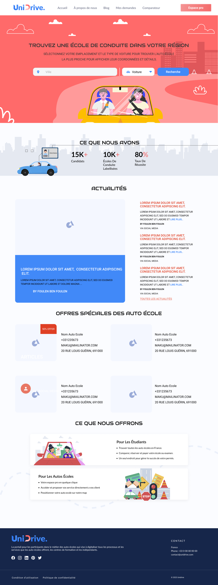
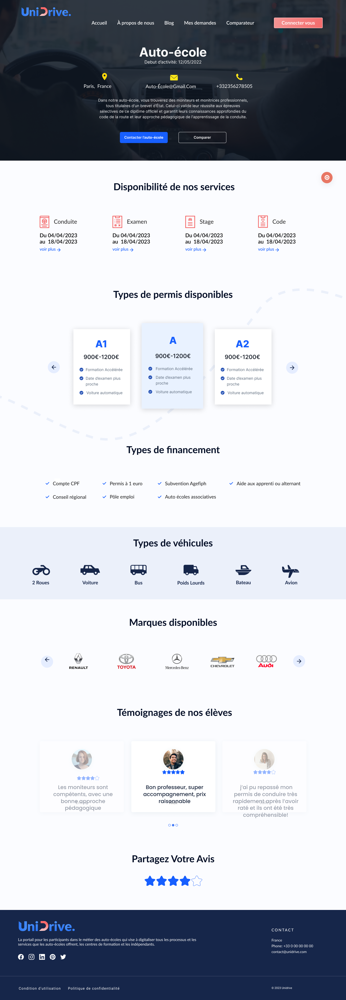
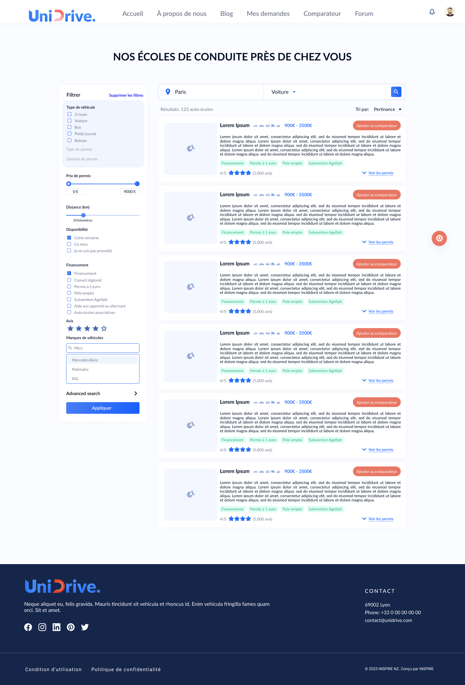

# UnDrive

**Finding the right driving school, in a few clicks**

A platform for searching driving schools by location and filtering on the details that actually matter to a learner. Designed as a freelancer with Inspire, a development agency.

| | |
|---|---|
| **Role** | UX / UI Designer (freelance) |
| **Client** | Inspire — development agency |
| **Year** | TODO |
| **Duration** | TODO |
| **Team** | Collaborative project with the Inspire team |
| **Status** | TODO — confirm whether UnDrive launched |
| **Platforms** | Website |
| **Tools** | Figma |

## Intro

As a freelancer at Inspire, a development agency, we worked on a project for a driving school. The platform lets users search for driving schools in any location and filter on the details that decide whether a school suits them.

## The solution

The result was an intuitive platform where location-based search and detailed filtering combine into a personalised result rather than a generic directory listing. Choosing a driving school that fits your specific requirements comes down to a few clicks, which is a meaningful improvement on ringing round or taking a recommendation on trust.

## The outcome

The homepage and its search entry point, an individual driving school page, and the filtered search listing.

*Homepage.*

*Driving school page.*

*Search listing.*

---

## TODO — needs Abdallah

_Not published copy. These are gaps I could not fill from the Figma file or the Notion export._

- [ ] UnDrive has no designs in the portfolio Figma file — these three images come from your Notion export. Send its Figma link and I'll pull proper screens.
- [ ] What year was this?
- [ ] Which market — France or Tunisia? The screens are in French.
- [ ] Did it launch? Is there a live URL?
- [ ] This is the thinnest project in the set. Either it gets more substance or consider cutting it.
