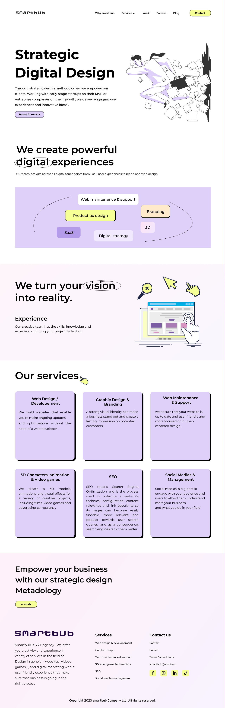
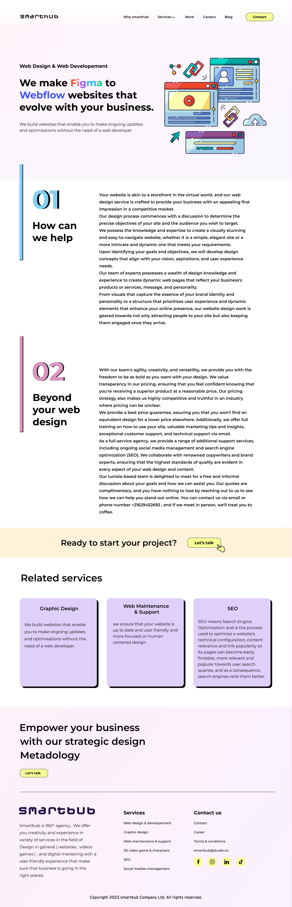
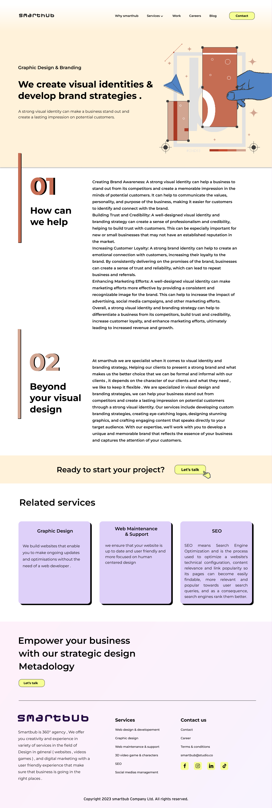
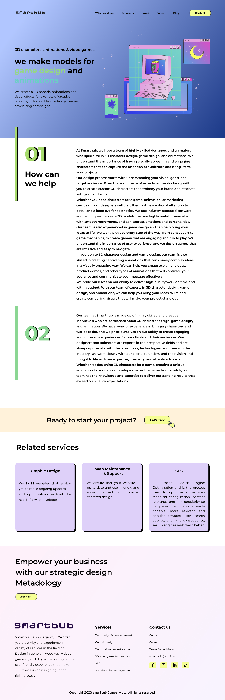
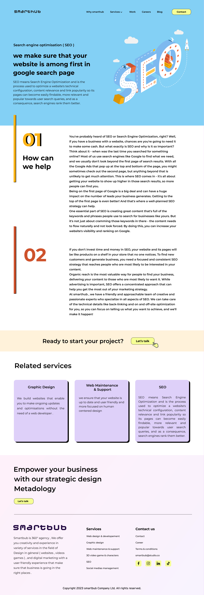
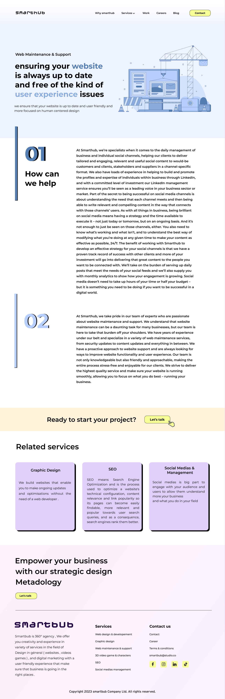
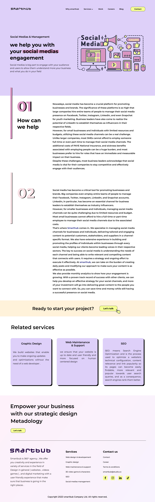
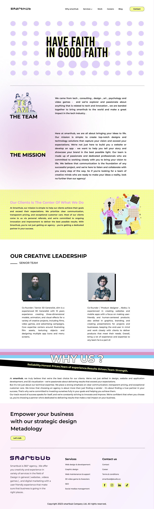

# Smarthub

**Designing the brand I run**

Smarthub is my own 360° agency — design and digital marketing, from websites and video games to branding and SEO. Eight pages covering every service line, the careers page, and the positioning that ties them together. Designing for yourself is harder than designing for a client, because there is nobody to say no to you.

| | |
|---|---|
| **Role** | Founder — design and brand |
| **Client** | Smarthub (my own agency) |
| **Year** | TODO |
| **Duration** | TODO |
| **Team** | TODO |
| **Status** | TODO — confirm whether the site is live |
| **Platforms** | Website |
| **Tools** | Figma |

## At a glance

- **8** — Pages designed

## About Smarthub

Smarthub is a 360° agency offering creativity and experience across design in general — websites, video games — and digital marketing, with the user experience treated as the thing that makes the business land in the right places. This is my own agency, so the site had to do two jobs at once: sell the work, and be a piece of the work.

## The positioning

The argument the site makes is that strategic design methodology is what empowers a client, whether that client is an early-stage startup working on an MVP or an established company chasing growth. The team designs across every digital touchpoint, from SaaS user experiences through to brand and web design — which is a wide claim, so the site has to substantiate it service by service rather than asserting it once on the homepage.

*Homepage.*

## A page per service

Rather than one services page listing everything, each line got its own page with its own argument. Web design and development is sold on autonomy — sites clients can keep updating and optimising without needing a developer every time. Graphic design and branding rests on visual identity as the thing that makes a business stand out and stick in memory. 3D characters, animation and visual effects covers film, video games and advertising campaigns. SEO is explained rather than name-dropped: optimising technical configuration, content relevance and link popularity so pages become findable and rank better. Web maintenance and support, and social media management, complete the set.

*Web design & development.*

*Graphic design & branding.*

*3D, animation & video games.*

*Search engine optimisation.*

*Web maintenance & support.*

*Social media & management.*

## Careers

A dedicated careers page, on the basis that an agency selling creative talent has to look like somewhere talent would want to work.

*Careers.*

---

## TODO — needs Abdallah

_Not published copy. These are gaps I could not fill from the Figma file or the Notion export._

- [ ] When did you design this, and is Smarthub currently trading?
- [ ] Is the site live? A URL would help.
- [ ] Do you have a logo or brand assets beyond the site? Branding work would strengthen this given it's your own agency.
- [ ] The homepage copy contains a typo — 'Smartbub' instead of 'Smarthub'. Worth fixing in Figma.
- [ ] Decide how prominently to feature your own agency next to client work; some people put it last, some lead with it.
